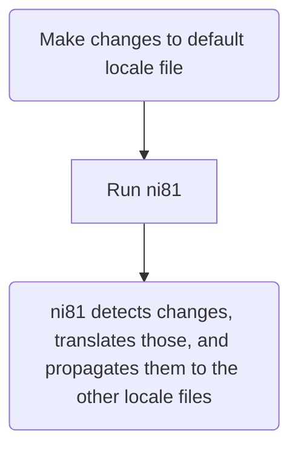

# ni81: Local i18n Management Tool

ni81 (pronounced "nibble") is a tool to manage your static i18n files and integrate local LLMs for translations. It addresses the challenge of managing static translation files, particularly those used by frameworks like [Next.js](https://nextjs.org/) - primarily via the [next-intl](https://next-intl.dev/) plugin.

The desired workflow with ni81 is 



## Installation

Build from source using `make build` or download one of the released binaries.

## Prerequisites

Currently ni81 only supports translations through models available that support the OpenAI API standard. The
most convenient option is to run a model locally through [ollama](https://ollama.com/).

## Usage

You will need to initialise your project in the project's root directory
```
nibl init
```
This will produce a TOML (`ni81.toml`) file in your project's root directory (which you should commit to your VCS).
If for any reason this file becomes corrupted you can remove it and re-run `init`, this will not effect the
existing translations provided by ni81. The initialise process will also order any existing JSON files (to avoid
clutter in future diffs when performing translations) and generate a file cache to use as a source of truth.
As with the generated config file you should also commit the file cache to your VCS.

Once the project has been initialised ni81 will make translations based on changes to your default locale
file. To translate use
```
nibl translate
```
This will translate the default locale to all supported locales in your project's `ni81.toml` file. If there
is a failure in any key-value pair of a locale, the entire locale will be skipped. Moreover, a failure will
cause the cache to not be updated so you can rerun `translate`.

Part of the translation process is the update of the cache (stored in the same directory as your i18n
translation files as `<default_locale>.cache.json`). This cache should be tracked in your VCS as it is necessary to determine what keys are
added/modified/removed in the future. If at any point you need to recreate your cache you can use
```
nibl cache
```
Keep in mind, doing so will make the default locale translation file, at the time this new cache is created,
the source of truth moving forward.

## TODO

 - [x] User input validation during initialisation
 - [x] Search up through parent directories (to file system root) for config file to allow use of
 `nibl` throughout all subdirectories of a project
 - [x] Create cache from `<default_locale>.json` if it exists
 - [ ] File cache for each supported locale for improved failure handling during translation
 - [x] Expand LLM support to remote through web API that follow OpenAI standard
 - [ ] Local glossary (on flattened JSON keys) management for translations
 - [ ] Locale flag for `translation` to translate to specified locale
 - [ ] Improved error logging
 - [x] Expand test coverage
